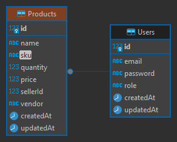

# Proyecto Marketplace

Este proyecto implementa un marketplace con funcionalidades para compradores, vendedores y administradores. El sistema está dividido en un backend (API) desarrollado con Node.js/Express y un frontend (UI) construido con React.

## Acceso de Administrador

Para acceder y evaluar la pantalla de administrador, que no es accesible de otra forma, utilice las siguientes credenciales:

- **Email**: <admin@example.com>
- **Contraseña**: 123456

Estas credenciales le permitirán acceder a la vista específica de administrador, donde podrá ver y gestionar todos los productos registrados en el marketplace.

## Tabla de Contenidos

1. [Requisitos](#requisitos)
2. [Configuración](#configuración)
3. [Instalación](#instalación)
4. [Uso](#uso)
5. [API Endpoints](#api-endpoints)
6. [Casos de Uso](#casos-de-uso)
7. [Estructura del Proyecto](#estructura-del-proyecto)
8. [Arquitectura del Backend](#arquitectura-del-backend)
9. [Integración Frontend-Backend](#integración-frontend-backend)
10.[Características de Seguridad](#características-de-seguridad)
11.[Estructura de la Base de Datos](#estructura-de-la-base-de-datos)

## Requisitos

- Node.js (v14 o superior)
- PostgreSQL
- npm o yarn

## Configuración

### Backend

1. Crea un archivo `.env` en la raíz del directorio backend con las siguientes variables:

```
PORT=3001
DB_NAME=your_database_name
DB_USER=your_database_user
DB_PASSWORD=your_database_password
DB_HOST=localhost
DB_PORT=5432
JWT_SECRET=your_jwt_secret
```

Asegúrate de reemplazar los valores con los apropiados para tu entorno.

### Frontend

1. Crea un archivo `.env` en la raíz del directorio frontend con las siguientes variables:

```
VITE_API_URL=http://localhost:3001/api/v1
```

## Instalación

1. Clona el repositorio:

   ```
   git clone https://github.com/tu-usuario/marketplace-project.git
   cd marketplace-project
   ```

2. Instala las dependencias del backend:

   ```
   cd backend
   npm install
   ```

3. Instala las dependencias del frontend:

   ```
   cd ../frontend
   npm install
   ```

## Uso

1. Inicia el backend:

   ```
   cd backend
   npm run dev
   ```

2. En otra terminal, inicia el frontend:

   ```
   cd frontend
   npm run dev
   ```

3. Abre tu navegador y visita `http://localhost:5173` para acceder a la aplicación.

## API Endpoints

### Autenticación

- `POST /api/v1/auth/register`: Registra un nuevo usuario
- `POST /api/v1/auth/login`: Inicia sesión de usuario
- `POST /api/v1/auth/set-role`: Establece el rol de un usuario
- `POST /api/v1/auth/change-role`: Cambia el rol de un usuario (requiere autenticación de administrador)

### Productos

- `GET /api/v1/products/search`: Busca productos
- `GET /api/v1/products/max-price`: Obtiene el precio máximo de los productos
- `GET /api/v1/products/vendors`: Obtiene la lista de vendedores
- `POST /api/v1/products`: Crea un nuevo producto (requiere autenticación de vendedor)
- `GET /api/v1/products`: Obtiene los productos del vendedor (requiere autenticación de vendedor)
- `GET /api/v1/products/all`: Obtiene todos los productos (requiere autenticación de administrador)

### Administrador

- `GET /api/v1/admin/products`: Obtiene todos los productos con opción de filtrar por vendedor (requiere autenticación de administrador)

## Casos de Uso

1. Registro de Usuario:
   - Un usuario puede registrarse proporcionando su correo electrónico y contraseña.
   - Después del registro, el usuario debe seleccionar su rol (comprador o vendedor).

2. Inicio de Sesión:
   - Los usuarios pueden iniciar sesión con su correo electrónico y contraseña.

3. Búsqueda de Productos:
   - Los compradores pueden buscar productos por nombre, SKU y rango de precios.

4. Creación de Productos:
   - Los vendedores pueden crear nuevos productos especificando nombre, SKU, cantidad y precio.

5. Gestión de Inventario:
   - Los vendedores pueden ver y gestionar su inventario de productos.

6. Panel de Administrador:
   - Los administradores pueden ver todos los productos registrados en el marketplace.

## Estructura del Proyecto

```
marketplace-project/
├── backend/
│   ├── src/
│   │   ├── app.ts
│   │   ├── server.ts
│   │   ├── application/
│   │   ├── domain/
│   │   ├── infrastructure/
│   │   └── types/
│   ├── package.json
│   └── tsconfig.json
├── frontend/
│   ├── src/
│   │   ├── components/
│   │   ├── pages/
│   │   ├── redux/
│   │   ├── services/
│   │   ├── types/
│   │   ├── App.tsx
│   │   └── main.tsx
│   ├── package.json
│   └── vite.config.ts
└── README.md
```

## Arquitectura del Backend

El backend de este proyecto está construido siguiendo los principios de la Arquitectura Hexagonal (también conocida como Puertos y Adaptadores) y adhiriéndose a las mejores prácticas de desarrollo.

### Principios SOLID y Buenas Prácticas

El proyecto sigue los principios SOLID y otras buenas prácticas de desarrollo:

1. **Single Responsibility Principle (SRP)**: Cada clase y módulo tiene una única responsabilidad.
2. **Open/Closed Principle (OCP)**: El sistema está diseñado para ser fácilmente extensible sin modificar el código existente.
3. **Liskov Substitution Principle (LSP)**: Las interfaces y clases abstractas se utilizan para permitir la sustitución de implementaciones.
4. **Interface Segregation Principle (ISP)**: Se utilizan interfaces específicas en lugar de interfaces generales.
5. **Dependency Inversion Principle (DIP)**: Los módulos de alto nivel no dependen de módulos de bajo nivel, ambos dependen de abstracciones.

### Patrones de Diseño Implementados

- **Repository Pattern**: Para la abstracción de la capa de datos.
- **Dependency Injection**: Para la inyección de dependencias y facilitar el testing.
- **Middleware Pattern**: Para el manejo de autenticación y validación en las rutas.

### Manejo de Errores y Seguridad

- Manejo de errores centralizado utilizando middleware de Express.
- Autenticación basada en JWT (JSON Web Tokens).
- Validación y sanitización de entradas de usuario.
- Uso de variables de entorno para la configuración sensible.

## Integración Frontend-Backend

Este proyecto se compone de un backend en Node.js/Express y un frontend en React, trabajando juntos para proporcionar una experiencia de usuario completa y fluida. A continuación, se detallan los aspectos clave de esta integración:

### 1. Comunicación API

- **Implementación**: El frontend se comunica con el backend a través de llamadas API RESTful, utilizando Axios para las peticiones HTTP.
- **Configuración**: La URL base de la API se configura en el frontend utilizando variables de entorno, permitiendo fácil cambio entre entornos de desarrollo y producción.
- **Manejo de Respuestas**: Las respuestas del servidor se procesan de manera consistente, extrayendo datos relevantes y manejando códigos de estado HTTP.

### 2. Gestión de Estado

- **Redux**: Se utiliza para manejar el estado global de la aplicación en el frontend.
- **Slices**: El estado se divide en slices lógicos (por ejemplo, auth, products) para una mejor organización y mantenimiento.
- **Thunks**: Se implementan thunks de Redux para manejar lógica asíncrona, como las llamadas a la API.
- **Selectores**: Se utilizan selectores para acceder eficientemente al estado y evitar renders innecesarios.

### 3. Autenticación

- **JWT**: El sistema de autenticación se basa en JSON Web Tokens (JWT).
- **Almacenamiento**: Los tokens se almacenan de forma segura en el localStorage del navegador.
- **Rutas Protegidas**: El frontend implementa un sistema de rutas protegidas que verifica la autenticación antes de permitir el acceso.

### 4. Roles de Usuario

- **Implementación Backend**: La lógica de roles (comprador, vendedor, administrador) se define y verifica en el backend.
- **Reflejo en Frontend**: La interfaz de usuario se adapta dinámicamente según el rol del usuario autenticado.
- **Control de Acceso**: Ciertas funcionalidades y rutas en el frontend están restringidas según el rol del usuario.
- **Middleware de Autorización**: El backend utiliza middleware para verificar los roles y permisos en cada solicitud relevante.

### 5. Manejo de Errores

- **Captura en Backend**: Los errores se capturan y formatean consistentemente en el backend.
- **Procesamiento en Frontend**: Los errores del backend se interpretan y manejan apropiadamente en el frontend.
- **Feedback al Usuario**: Se implementan componentes de UI (como toasts o modales) para mostrar mensajes de error al usuario.

### 6. Carga Dinámica

- **React Query**: Se utiliza para la gestión eficiente de datos y estados de carga en el frontend.
- **Caché**: React Query implementa un sistema de caché inteligente que reduce las llamadas innecesarias al backend.
- **Estados de Carga**: Se manejan estados de carga, éxito y error para cada operación, mejorando la experiencia del usuario.
- **Revalidación**: Se implementan estrategias de revalidación de datos para mantener la información actualizada.

### 7. Renderizado Condicional

- **Componentes Inteligentes**: El frontend utiliza componentes que se renderizan condicionalmente basados en el estado de autenticación y el rol del usuario.

## Características de Seguridad

El proyecto implementa varias medidas de seguridad para proteger los datos de los usuarios y asegurar el correcto funcionamiento del sistema:

### Autenticación y Autorización

1. **JSON Web Tokens (JWT)**:
   - Se utiliza JWT para el control de sesiones y la autenticación de usuarios.
   - Cada token contiene información encriptada sobre el usuario, incluyendo su rol y permisos.
   - Los tokens se envían en cada solicitud para autenticar al usuario.

2. **Proceso de Autenticación**:
   - Cuando un usuario inicia sesión, se verifica su identidad y se genera un JWT.
   - Este token se almacena en el lado del cliente (localStorage) y se incluye en las cabeceras de las solicitudes HTTP subsiguientes.

3. **Autorización basada en roles**:
   - El sistema implementa un control de acceso basado en roles (RBAC).
   - Los roles (comprador, vendedor, administrador) determinan qué acciones puede realizar un usuario en el sistema.
   - El backend verifica los permisos del usuario antes de permitir acciones específicas.

### Seguridad de Contraseñas

1. **Hashing con bcrypt**:
   - Todas las contraseñas de usuario se hashean utilizando bcrypt antes de almacenarse en la base de datos.
   - bcrypt proporciona un alto nivel de seguridad contra ataques de fuerza bruta y de diccionario.

2. **Salting**:
   - bcrypt implementa automáticamente el salting de contraseñas, añadiendo una capa adicional de seguridad.

### Protección de Rutas

- Las rutas sensibles en el backend están protegidas y requieren un token JWT válido para acceder.
- En el frontend, se implementa un sistema de rutas protegidas que verifica la autenticación y los roles antes de permitir el acceso a ciertas páginas o funcionalidades.

### Manejo Seguro de Datos

- Los datos sensibles, como las credenciales de la base de datos y las claves secretas para JWT, se almacenan en variables de entorno y no se incluyen en el código fuente.

Estas medidas de seguridad trabajan en conjunto para proporcionar un entorno seguro para los usuarios del marketplace, protegiendo tanto los datos personales como la integridad del sistema.

## Estructura de la Base de Datos



El sistema utiliza una base de datos relacional con dos tablas principales: Products y Users. A continuación se describe la estructura y relaciones de estas tablas:

### Tabla Products

- **id**: Identificador único del producto (clave primaria)
- **name**: Nombre del producto
- **sku**: Código único de producto (Stock Keeping Unit)
- **quantity**: Cantidad disponible del producto
- **price**: Precio del producto
- **sellerId**: ID del vendedor (clave foránea que relaciona con la tabla Users)
- **vendor**: Nombre del vendedor
- **createdAt**: Fecha y hora de creación del registro
- **updatedAt**: Fecha y hora de la última actualización del registro

### Tabla Users

- **id**: Identificador único del usuario (clave primaria)
- **email**: Correo electrónico del usuario (único)
- **password**: Contraseña del usuario (hasheada)
- **role**: Rol del usuario en el sistema
- **createdAt**: Fecha y hora de creación del registro
- **updatedAt**: Fecha y hora de la última actualización del registro

### Relaciones

- Existe una relación uno a muchos (1:N) entre Users y Products.
- Un usuario (vendedor) puede tener múltiples productos, pero cada producto pertenece a un solo vendedor.
- Esta relación se establece a través del campo `sellerId` en la tabla Products, que es una clave foránea que referencia el `id` de la tabla Users.

Esta estructura permite una gestión eficiente de los productos y usuarios en el marketplace, facilitando operaciones como la búsqueda de productos por vendedor, la gestión de inventario por parte de los vendedores, y el control de acceso basado en roles de usuario.
